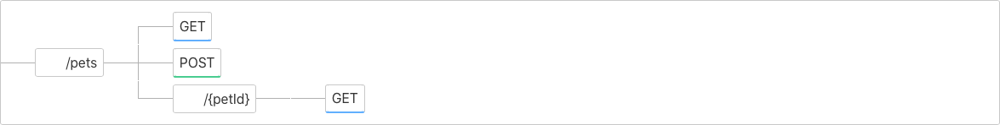

# OpenAPIVisualiser

A utility for visualising the paths of an OpenAPI definition. 

This application supports a query parameter, url, which can be used to pre-load a definition in to the application. 

For example:
http://localhost:4200/?url=https:%2F%2Fraw.githubusercontent.com%2FMermade%2Fopenapi3-examples%2Fmaster%2Fpass%2FOAI%2Fuber.yaml

A large number of public API specifications which can be used for testing are available here: https://apis.guru/browse-apis/

## Development server

Run `ng serve` for a dev server. Navigate to `http://localhost:4200/`. The app will automatically reload if you change any of the source files.

## Development container

When running `ng serve` from in the development container, to allow it to listen to connections
from the source machine browser, it needs to be ran with a host (as localhost won't allow it to
accept connections).

`ng serve --host 0.0.0.0`

## Build

Run `ng build` to build the project. The build artifacts will be stored in the `dist/` directory. Use the `--prod` flag for a production build.

## Running unit tests

Run `ng test` to execute the unit tests via [Karma](https://karma-runner.github.io).

## Running end-to-end tests

Run `npm run e2e` to execute the end-to-end tests via [Cypress](https://cypress.io/).

This will also start up a local server. If you just want to run the tests you can either use `npm run cy:run` or `npm run cy:open` depending on if you want to run the tests headless or not. 

## Building for deployment
[This guide](https://angular.io/guide/deployment#deploy-to-github-pages) details how to deploy Angular applications to GitHub pages. 

The package.json defines a "build-deployment" script that can be ran to recompile the project in to the `dist` directory. A GitHub action is configured for this repository so that pushes to master will run this and publish the output to GitHub Pages, hosted at: https://www.devwithimagination.com/OpenApiVisualiser/

This can be ran by running the command:
`npm run-script build-deployment`
