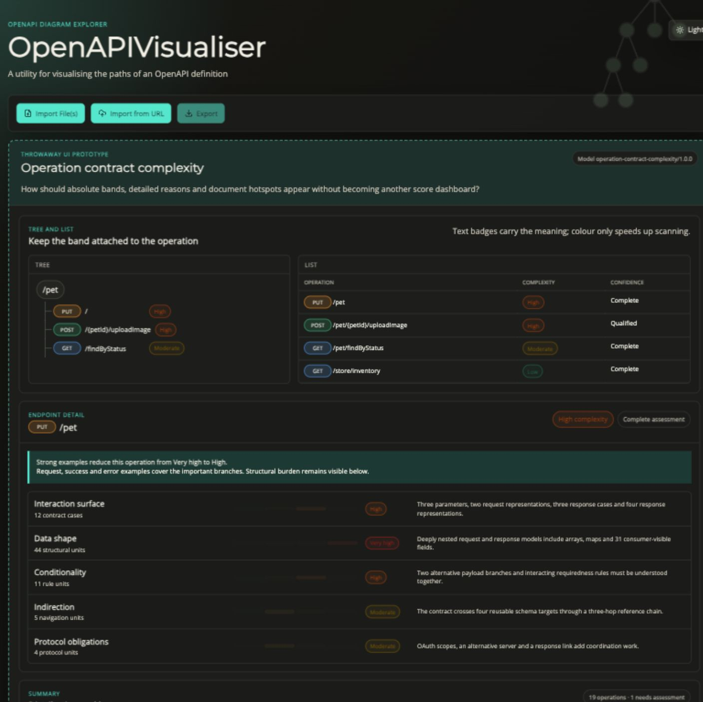
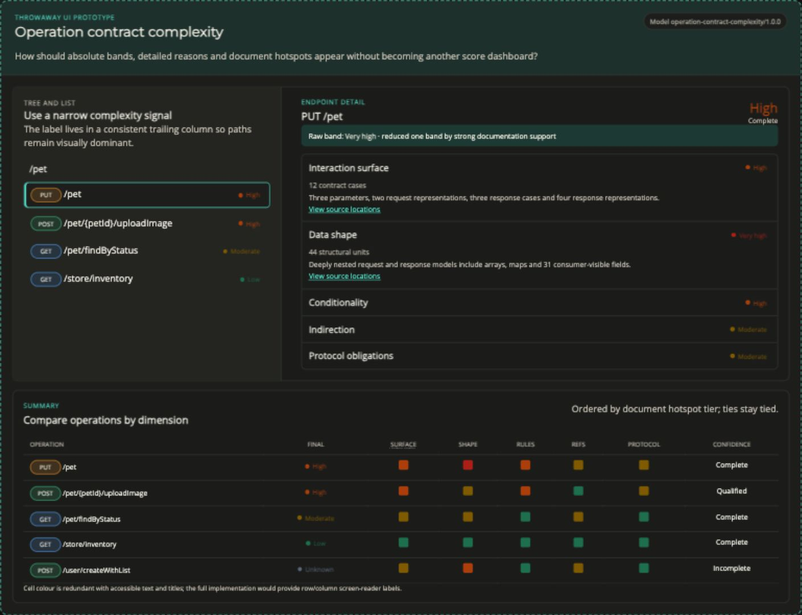
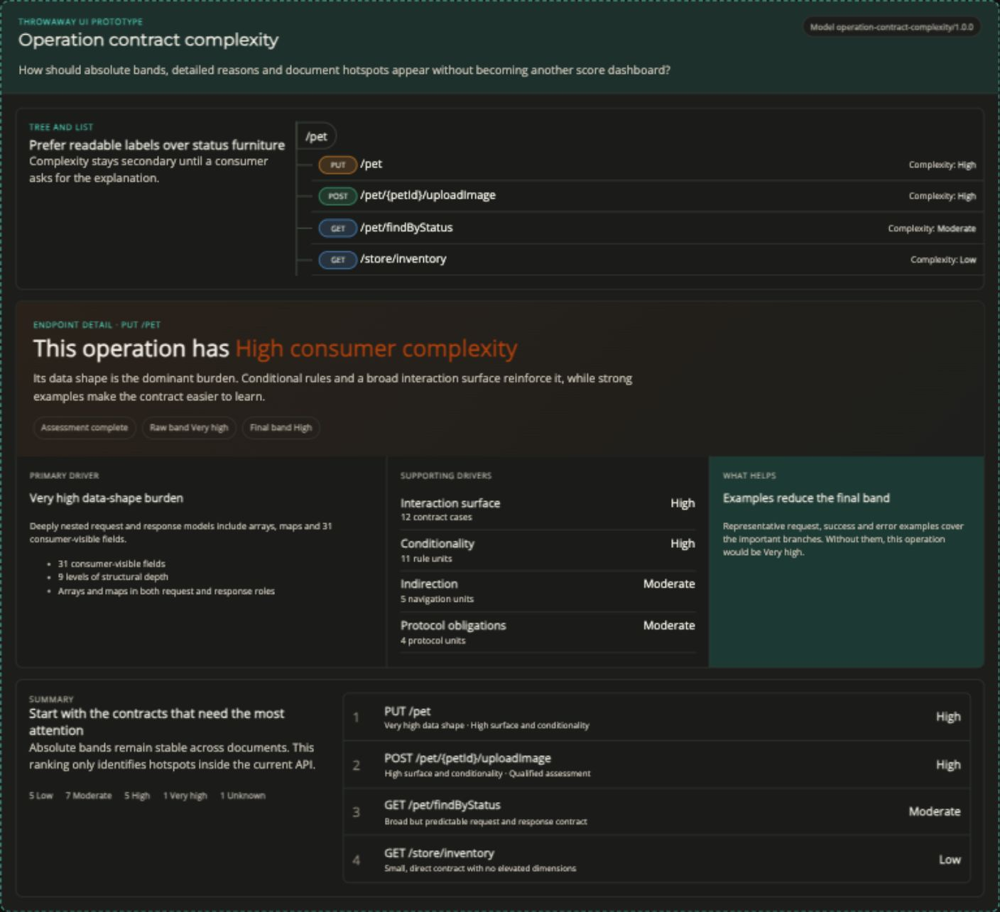

# Operation complexity explanation prototype

This is a throwaway prototype for deciding how operation contract complexity should appear across tree/list, endpoint detail, and summary surfaces.

Run it with:

```sh
npm start
```

Then compare the three variants on the existing application route:

- `http://localhost:4200/?variant=A` — Band first
- `http://localhost:4200/?variant=B` — Comparison matrix
- `http://localhost:4200/?variant=C` — Explain the burden

Use the floating switcher or the left and right arrow keys to move between variants. The prototype and switcher are development-only and must not be promoted directly to production.

## Decision

Variant C, **Explain the burden**, is the implementation baseline. It provides the most information while keeping a clear hierarchy:

- Tree and list surfaces keep the absolute band readable but secondary to the operation.
- Endpoint detail leads with a plain-language explanation, then separates the primary driver, supporting drivers, assessment confidence, raw/final bands, and the mitigating effect of examples.
- Summary leads with document-relative hotspots while retaining the stable absolute-band distribution.

The other variants remain useful sources rather than rejected dead ends. Variant A demonstrates explicit inline band badges and a complete dimension profile. Variant B demonstrates progressive dimension disclosure and dense cross-operation comparison. Their screenshots are retained so future iterations can deliberately borrow those elements.

### Variant A — Band first



### Variant B — Comparison matrix



### Variant C — Explain the burden (selected)


